# Linux User Access Audit Lab — Logbook

## 2026-07-01 — Part 1: Repository setup

### Goal

Start the Linux User Access Audit Lab by creating the local project structure, initial documentation files and project folders.

### Work completed

* Created the local project folder.
* Created the main documentation folders:

  * docs
  * screenshots
  * scripts
  * results
* Created `README.md`.
* Created `logbook.md`.
* Created `.gitkeep` files so Git can track empty folders.
* Opened the project in VS Code.
* Saved screenshot evidence.

### Project structure

```text
Linux-User-Access-Audit-Lab/
├── docs/
│   └── .gitkeep
├── results/
│   └── .gitkeep
├── screenshots/
│   └── .gitkeep
├── scripts/
│   └── .gitkeep
├── logbook.md
└── README.md
```

### Commands used

```powershell
cd C:\Users\*****
mkdir Linux-User-Access-Audit-Lab
cd Linux-User-Access-Audit-Lab

mkdir docs
mkdir screenshots
mkdir scripts
mkdir results

New-Item README.md
New-Item logbook.md

New-Item docs\.gitkeep
New-Item screenshots\.gitkeep
New-Item scripts\.gitkeep
New-Item results\.gitkeep

code .
```

### Command purpose

| Command                             | Purpose                                                |
| ----------------------------------- | ------------------------------------------------------ |
| `cd C:\Users\*****`                 | Moves PowerShell to the user folder.                   |
| `mkdir Linux-User-Access-Audit-Lab` | Creates the main project folder.                       |
| `cd Linux-User-Access-Audit-Lab`    | Moves into the project folder.                         |
| `mkdir docs`                        | Creates the documentation folder.                      |
| `mkdir screenshots`                 | Creates the screenshot evidence folder.                |
| `mkdir scripts`                     | Creates the script storage folder.                     |
| `mkdir results`                     | Creates the command output and result storage folder.  |
| `New-Item README.md`                | Creates the main README file.                          |
| `New-Item logbook.md`               | Creates the project logbook file.                      |
| `New-Item .gitkeep`                 | Creates placeholder files so Git tracks empty folders. |
| `code .`                            | Opens the current project folder in VS Code.           |

### Notes

This part created the documentation base for the Linux User Access Audit Lab.

The project will continue with a Linux account baseline before users, groups or access audit scenarios are created.

Only safe lab data should be used in this project. No real secrets, credentials, private files or production data should be included.

### Evidence

Screenshot:

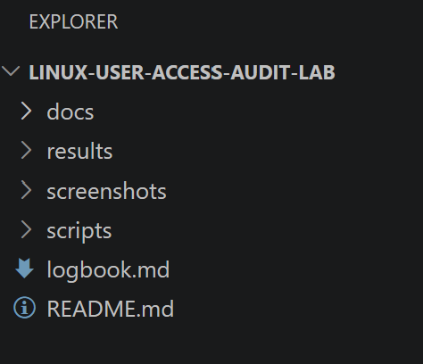

---

## 2026-07-01 — Part 2: Linux account baseline

### Goal

Review the Linux account baseline before creating users, groups or access audit scenarios.

### Work completed

* Reviewed hostname and system information.
* Verified the current logged-in user.
* Reviewed user ID and group membership information.
* Reviewed the Linux operating system version.
* Reviewed the kernel version.
* Reviewed current date and uptime.
* Reviewed local user database entries.
* Reviewed local group database entries.
* Reviewed current user group membership.
* Reviewed current user sudo privileges.
* Reviewed `/home` directory ownership and permissions.
* Reviewed existing home folders.
* Saved screenshot evidence.

### Verification results

| Item                | Result                          |
| ------------------- | ------------------------------- |
| System identity     | Reviewed with `hostnamectl`     |
| Current user        | Reviewed with `whoami`          |
| User and groups     | Reviewed with `id`              |
| OS version          | Reviewed with `/etc/os-release` |
| Kernel version      | Reviewed with `uname -r`        |
| Date and uptime     | Reviewed                        |
| Local users         | Reviewed with `getent passwd`   |
| Local groups        | Reviewed with `getent group`    |
| Current user groups | Reviewed with `groups`          |
| Sudo access         | Reviewed with `sudo -l`         |
| Home folders        | Reviewed with `ls`              |

### Commands used

```bash
hostnamectl
whoami
id
cat /etc/os-release
uname -r
date
uptime

getent passwd | head -20
getent passwd | tail -20

getent group | head -20
getent group | tail -20

groups
sudo -l

ls -ld /home
ls -l /home
```

### Command purpose

| Command                     | Purpose                                                    |
| --------------------------- | ---------------------------------------------------------- |
| `hostnamectl`               | Shows hostname, operating system, kernel and architecture. |
| `whoami`                    | Shows the current logged-in user.                          |
| `id`                        | Shows user ID, group ID and group memberships.             |
| `cat /etc/os-release`       | Shows the Linux distribution and version.                  |
| `uname -r`                  | Shows the running kernel version.                          |
| `date`                      | Shows the current system date and time.                    |
| `uptime`                    | Shows how long the system has been running.                |
| `getent passwd \| head -20` | Shows the first local user database entries.               |
| `getent passwd \| tail -20` | Shows the last local user database entries.                |
| `getent group \| head -20`  | Shows the first local group database entries.              |
| `getent group \| tail -20`  | Shows the last local group database entries.               |
| `groups`                    | Shows the current user’s group memberships.                |
| `sudo -l`                   | Shows what sudo privileges the current user has.           |
| `ls -ld /home`              | Shows ownership and permissions for `/home`.               |
| `ls -l /home`               | Lists existing home folders.                               |

### Notes

This baseline check gives the project a clean starting point before test users and access audit scenarios are created.

The review confirms the current account state before changes are made.

The commands used in this part are useful for Linux helpdesk, junior sysadmin and basic access review work.

### Evidence

Screenshots:

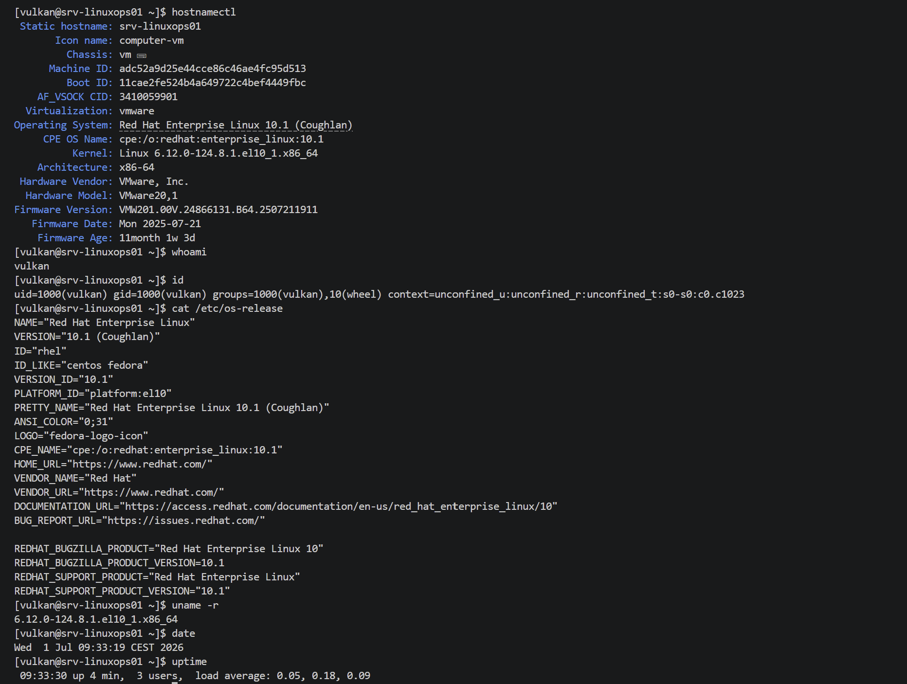

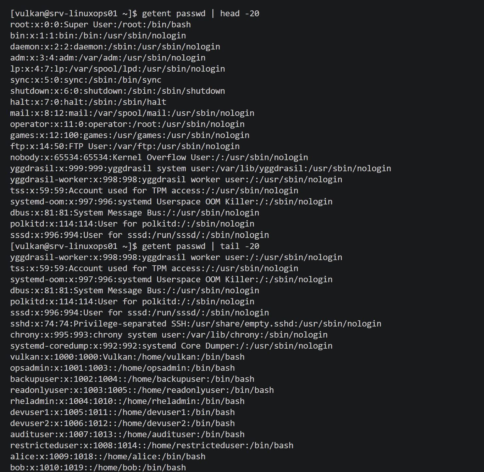

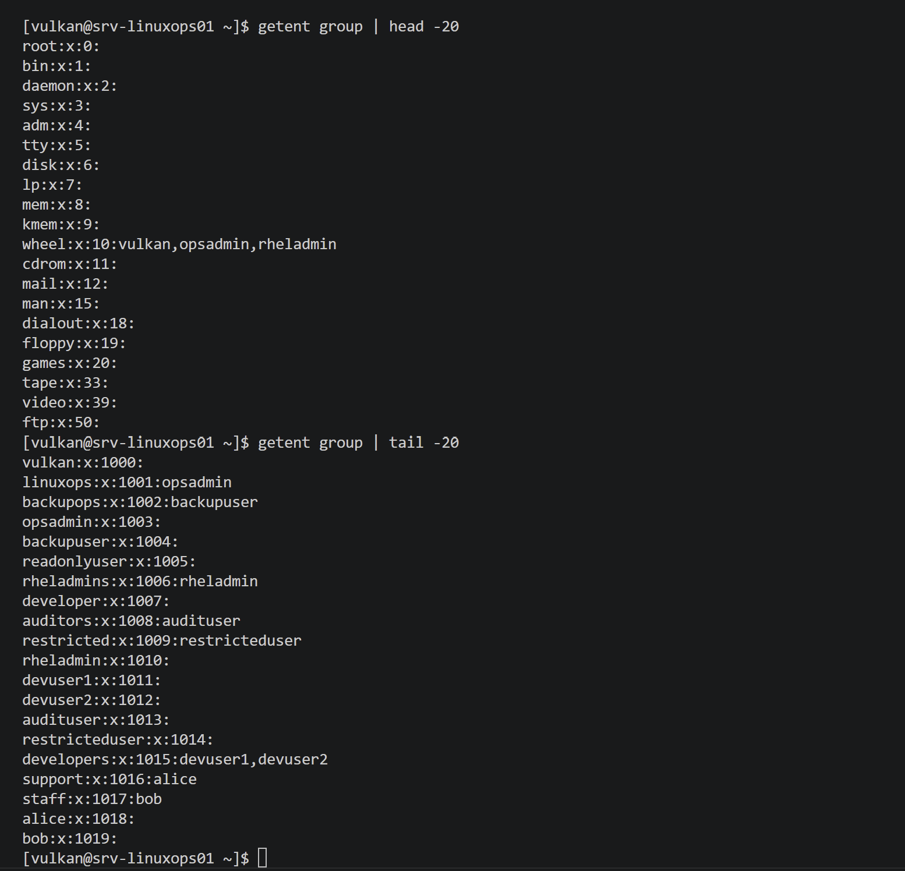

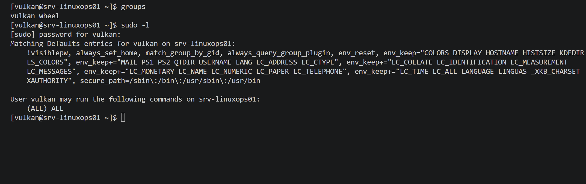

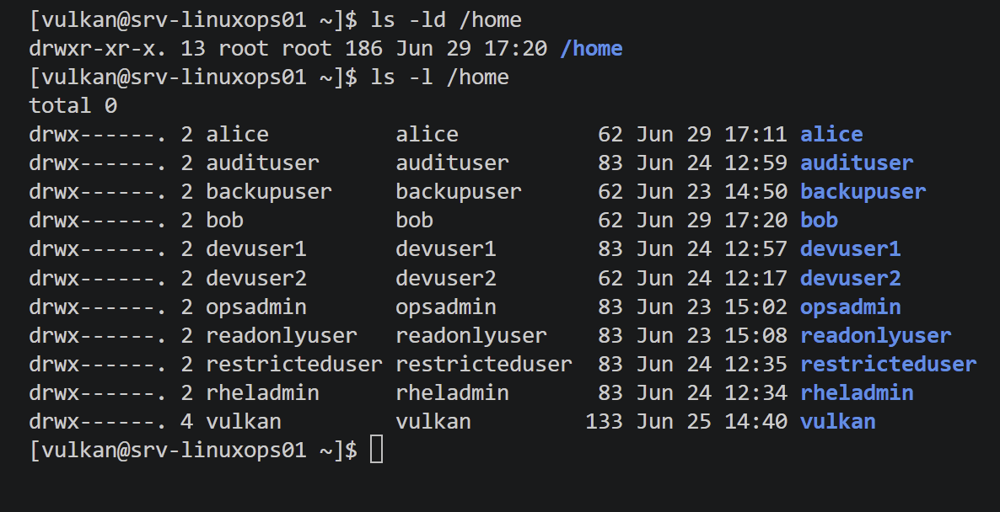

---

## 2026-07-01 — Part 3: Create test users and groups

### Goal

Create and verify safe test users and groups for Linux access audit scenarios.

### Work completed

* Created or verified the `audit_team` group.
* Created or verified the `contractors` group.
* Created or verified the `disabled_test` group.
* Verified the `audituser` test account.
* Created and verified the `contractor1` test account.
* Created and verified the `olduser` test account.
* Added `audituser` to the `audit_team` group.
* Added `contractor1` to the `contractors` group.
* Added `olduser` to the `disabled_test` group.
* Set safe lab passwords for the test users.
* Verified user IDs and group memberships.
* Verified group database entries.
* Verified passwd database entries.
* Verified home folder ownership and permissions.
* Saved screenshot evidence.

### Verification results

| Item                           | Result               |
| ------------------------------ | -------------------- |
| Group `audit_team`             | Created or verified  |
| Group `contractors`            | Created or verified  |
| Group `disabled_test`          | Created or verified  |
| User `audituser`               | Verified             |
| User `contractor1`             | Created and verified |
| User `olduser`                 | Created and verified |
| `audituser` group membership   | `audit_team`         |
| `contractor1` group membership | `contractors`        |
| `olduser` group membership     | `disabled_test`      |
| Home folders                   | Verified             |

### Commands used

```bash
sudo groupadd audit_team
sudo groupadd contractors
sudo groupadd disabled_test

sudo useradd -m -G audit_team audituser
sudo useradd -m -G contractors contractor1
sudo useradd -m -G disabled_test olduser

sudo usermod -aG audit_team audituser

sudo passwd audituser
sudo passwd contractor1
sudo passwd olduser

id audituser
id contractor1
id olduser

getent group audit_team
getent group contractors
getent group disabled_test

getent passwd audituser
getent passwd contractor1
getent passwd olduser

ls -ld /home/audituser
ls -ld /home/contractor1
ls -ld /home/olduser
```

### Command purpose

| Command                                      | Purpose                                                                                                |
| -------------------------------------------- | ------------------------------------------------------------------------------------------------------ |
| `sudo groupadd audit_team`                   | Creates the audit team group.                                                                          |
| `sudo groupadd contractors`                  | Creates the contractors group.                                                                         |
| `sudo groupadd disabled_test`                | Creates the disabled test group.                                                                       |
| `sudo useradd -m -G audit_team audituser`    | Creates `audituser` with a home folder and adds it to `audit_team` if the user does not already exist. |
| `sudo useradd -m -G contractors contractor1` | Creates `contractor1` with a home folder and adds it to `contractors`.                                 |
| `sudo useradd -m -G disabled_test olduser`   | Creates `olduser` with a home folder and adds it to `disabled_test`.                                   |
| `sudo usermod -aG audit_team audituser`      | Adds the existing `audituser` account to the `audit_team` group.                                       |
| `sudo passwd audituser`                      | Sets a safe lab password for `audituser`.                                                              |
| `sudo passwd contractor1`                    | Sets a safe lab password for `contractor1`.                                                            |
| `sudo passwd olduser`                        | Sets a safe lab password for `olduser`.                                                                |
| `id audituser`                               | Shows user ID and group memberships for `audituser`.                                                   |
| `id contractor1`                             | Shows user ID and group memberships for `contractor1`.                                                 |
| `id olduser`                                 | Shows user ID and group memberships for `olduser`.                                                     |
| `getent group audit_team`                    | Shows the `audit_team` group entry and members.                                                        |
| `getent group contractors`                   | Shows the `contractors` group entry and members.                                                       |
| `getent group disabled_test`                 | Shows the `disabled_test` group entry and members.                                                     |
| `getent passwd audituser`                    | Shows the passwd database entry for `audituser`.                                                       |
| `getent passwd contractor1`                  | Shows the passwd database entry for `contractor1`.                                                     |
| `getent passwd olduser`                      | Shows the passwd database entry for `olduser`.                                                         |
| `ls -ld /home/audituser`                     | Shows ownership and permissions for the `audituser` home folder.                                       |
| `ls -ld /home/contractor1`                   | Shows ownership and permissions for the `contractor1` home folder.                                     |
| `ls -ld /home/olduser`                       | Shows ownership and permissions for the `olduser` home folder.                                         |

### Notes

The test users and groups are used only for safe lab access audit practice.

The `audituser` account already existed in the lab environment, so the account was verified and added to the `audit_team` group.

The `audituser` account also belongs to the `auditors` group, which provides useful audit evidence for later group membership review.

### Evidence

Screenshots:

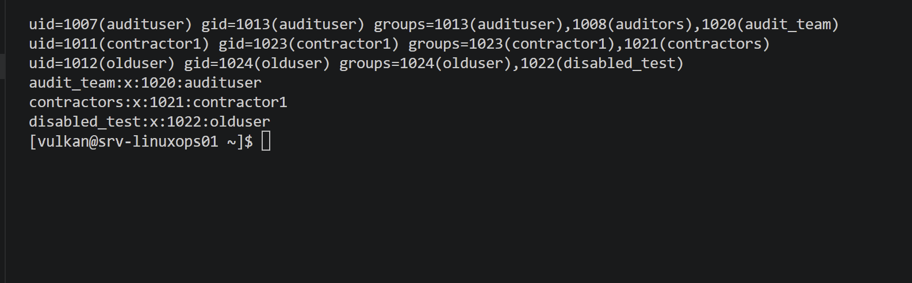

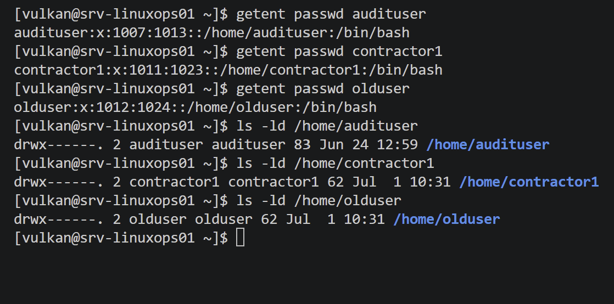

---

## 2026-07-01 — Part 4: Review user and group files

### Goal

Review Linux user and group database files used for local account and access management.

### Work completed

* Reviewed `/etc/passwd` ownership and permissions.
* Reviewed passwd entries for `audituser`, `contractor1` and `olduser`.
* Reviewed `/etc/group` ownership and permissions.
* Reviewed group entries for `audit_team`, `contractors` and `disabled_test`.
* Reviewed `/etc/shadow` ownership and permissions safely.
* Reviewed `/etc/gshadow` ownership and permissions safely.
* Confirmed the purpose of the main Linux account database files.
* Used a safe text summary because `man 5 passwd` was not available on the system.
* Saved screenshot evidence.

### Verification results

| Item                       | Result          |
| -------------------------- | --------------- |
| `/etc/passwd` permissions  | Reviewed        |
| Test user passwd entries   | Reviewed        |
| `/etc/group` permissions   | Reviewed        |
| Test group entries         | Reviewed        |
| `/etc/shadow` permissions  | Reviewed safely |
| `/etc/gshadow` permissions | Reviewed safely |
| Account file purpose       | Reviewed        |
| Sensitive contents exposed | No              |

### Commands used

```bash
ls -l /etc/passwd
getent passwd audituser
getent passwd contractor1
getent passwd olduser

ls -l /etc/group
getent group audit_team
getent group contractors
getent group disabled_test

sudo ls -l /etc/shadow
sudo ls -l /etc/gshadow

echo "/etc/passwd stores local user account information."
echo "/etc/group stores local group information."
echo "/etc/shadow stores local password hash and password aging information."
echo "/etc/gshadow stores secure group account information."
```

### Command purpose

| Command                      | Purpose                                                                                         |
| ---------------------------- | ----------------------------------------------------------------------------------------------- |
| `ls -l /etc/passwd`          | Shows ownership and permissions for the local user account database file.                       |
| `getent passwd audituser`    | Shows the passwd entry for `audituser`.                                                         |
| `getent passwd contractor1`  | Shows the passwd entry for `contractor1`.                                                       |
| `getent passwd olduser`      | Shows the passwd entry for `olduser`.                                                           |
| `ls -l /etc/group`           | Shows ownership and permissions for the local group database file.                              |
| `getent group audit_team`    | Shows the `audit_team` group entry and members.                                                 |
| `getent group contractors`   | Shows the `contractors` group entry and members.                                                |
| `getent group disabled_test` | Shows the `disabled_test` group entry and members.                                              |
| `sudo ls -l /etc/shadow`     | Shows ownership and permissions for the shadow password file without exposing password hashes.  |
| `sudo ls -l /etc/gshadow`    | Shows ownership and permissions for the secure group file without exposing sensitive contents.  |
| `echo ...`                   | Provides a safe summary of the account file purposes because man page lookup was not available. |

### Notes

This part reviewed the main Linux account database files.

The `/etc/passwd` file stores local user account information.

The `/etc/group` file stores local group information.

The `/etc/shadow` file stores password hash and password aging information.

The `/etc/gshadow` file stores secure group account information.

Sensitive files were reviewed safely by checking file permissions only. The contents of `/etc/shadow` and `/etc/gshadow` were not displayed or documented.

### Evidence

Screenshots:


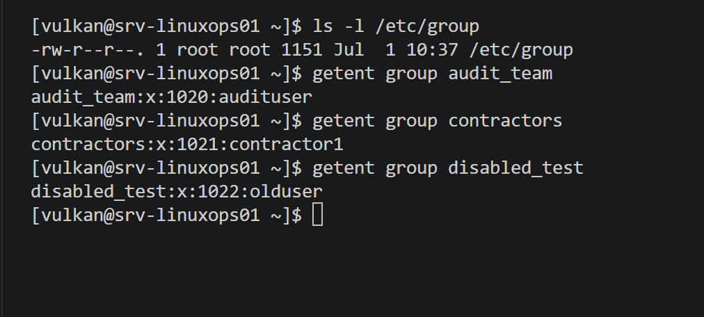

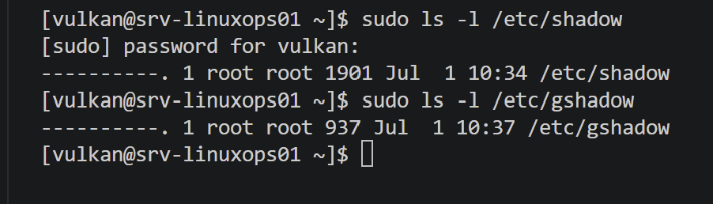

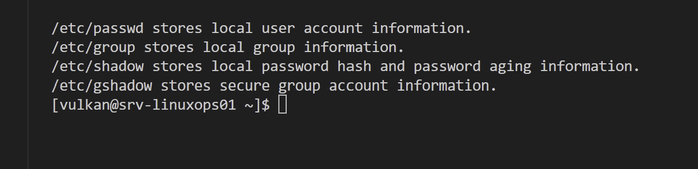

---

## 2026-07-01 — Part 5: Audit sudo access

### Goal

Review sudo access, admin-related group membership and sudoers file locations safely.

### Work completed

* Reviewed the current logged-in user.
* Reviewed current user group memberships.
* Reviewed current user sudo permissions.
* Reviewed common admin-related groups.
* Reviewed lab access groups.
* Reviewed sudo permissions for `audituser`.
* Reviewed sudo permissions for `contractor1`.
* Reviewed sudo permissions for `olduser`.
* Reviewed `/etc/sudoers` ownership and permissions safely.
* Reviewed `/etc/sudoers.d` ownership and permissions safely.
* Reviewed files inside `/etc/sudoers.d` safely.
* Saved screenshot evidence.

### Verification results

| Item | Result |
| --- | --- |
| Current user | Reviewed |
| Current user groups | Reviewed |
| Current user sudo access | Reviewed |
| Admin-related groups | Reviewed |
| Test user sudo access | Reviewed |
| `/etc/sudoers` permissions | Reviewed safely |
| `/etc/sudoers.d` permissions | Reviewed safely |
| Sensitive sudoers contents exposed | No |

### Commands used

```bash
whoami
groups
sudo -l

getent group wheel
getent group sudo
getent group adm
getent group audit_team
getent group contractors
getent group disabled_test

sudo -l -U audituser
sudo -l -U contractor1
sudo -l -U olduser

sudo ls -l /etc/sudoers
sudo ls -ld /etc/sudoers.d
sudo ls -l /etc/sudoers.d
```

### Command purpose

| Command | Purpose |
| --- | --- |
| `whoami` | Shows the current logged-in user. |
| `groups` | Shows the current user’s group memberships. |
| `sudo -l` | Shows sudo permissions for the current user. |
| `getent group wheel` | Reviews the common RHEL/Fedora admin group. |
| `getent group sudo` | Reviews the common Debian/Ubuntu admin group. |
| `getent group adm` | Reviews a common admin/log-related group. |
| `getent group audit_team` | Reviews the lab audit group. |
| `getent group contractors` | Reviews the lab contractor group. |
| `getent group disabled_test` | Reviews the lab disabled-test group. |
| `sudo -l -U audituser` | Reviews sudo permissions for `audituser`. |
| `sudo -l -U contractor1` | Reviews sudo permissions for `contractor1`. |
| `sudo -l -U olduser` | Reviews sudo permissions for `olduser`. |
| `sudo ls -l /etc/sudoers` | Shows sudoers file ownership and permissions without displaying contents. |
| `sudo ls -ld /etc/sudoers.d` | Shows ownership and permissions for the sudoers include directory. |
| `sudo ls -l /etc/sudoers.d` | Lists sudoers include files safely. |

### Notes

This part demonstrates basic sudo access auditing.

Sudo access is important to review because it can allow users to run commands with elevated privileges.

The test users were checked individually to confirm whether they had sudo permissions.

Sudoers file locations were reviewed safely by checking file ownership and permissions only. The contents of `/etc/sudoers` were not displayed or documented.

### Evidence

Screenshots:

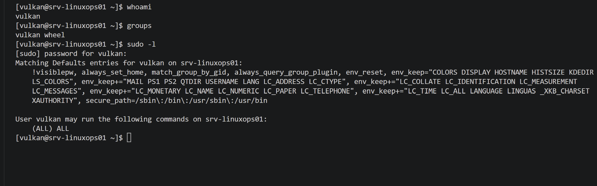

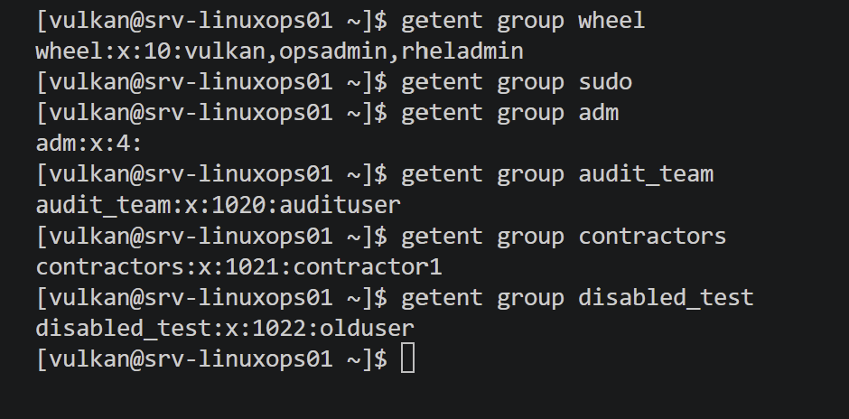

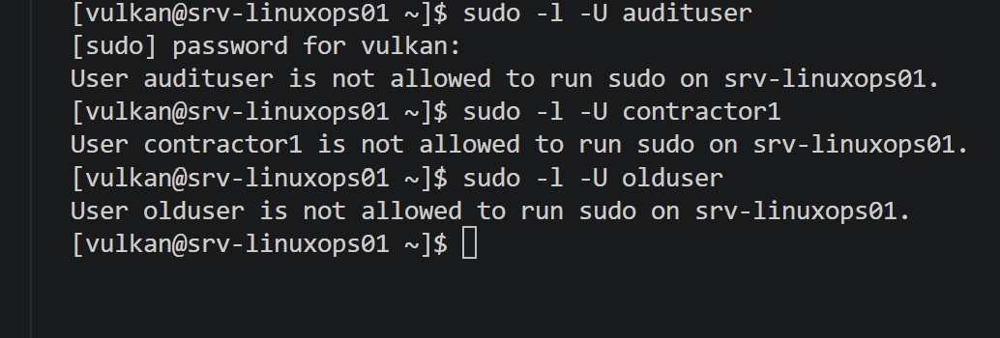

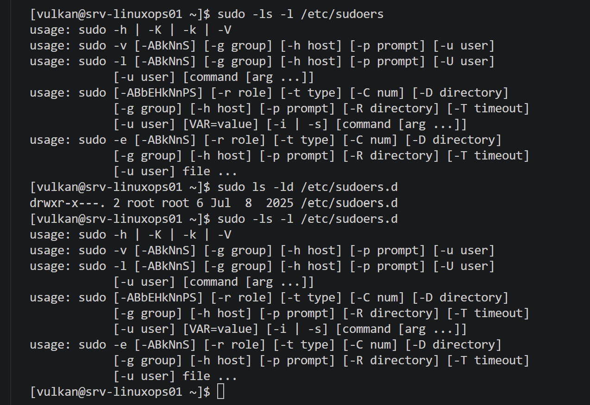

---

## 2026-07-01 — Part 6: Check home folder permissions

### Goal

Review home folder ownership, permissions, contents and cross-user access behavior.

### Work completed

* Reviewed `/home` ownership and permissions.
* Reviewed `/home/audituser` ownership and permissions.
* Reviewed `/home/contractor1` ownership and permissions.
* Reviewed `/home/olduser` ownership and permissions.
* Reviewed home folder contents safely with administrator access.
* Tested cross-user access to home folders.
* Created an audit note about home folder permission review.
* Saved screenshot evidence.

### Verification results

| Item | Result |
| --- | --- |
| `/home` permissions | Reviewed |
| `audituser` home folder | Reviewed |
| `contractor1` home folder | Reviewed |
| `olduser` home folder | Reviewed |
| Home folder contents | Reviewed safely |
| Cross-user access | Tested |
| Audit note | Created |

### Commands used

```bash
ls -ld /home
ls -ld /home/audituser
ls -ld /home/contractor1
ls -ld /home/olduser

sudo ls -la /home/audituser | head -20
sudo ls -la /home/contractor1 | head -20
sudo ls -la /home/olduser | head -20

sudo -u audituser ls /home/contractor1
sudo -u contractor1 ls /home/audituser
sudo -u olduser ls /home/audituser

echo "Home folder permissions were reviewed for audituser, contractor1 and olduser."
echo "Cross-user access testing was performed using sudo -u."
echo "Any world-readable home folder permissions should be reviewed in a real environment."
```

### Command purpose

| Command | Purpose |
| --- | --- |
| `ls -ld /home` | Shows ownership and permissions for the `/home` directory. |
| `ls -ld /home/audituser` | Shows ownership and permissions for the `audituser` home folder. |
| `ls -ld /home/contractor1` | Shows ownership and permissions for the `contractor1` home folder. |
| `ls -ld /home/olduser` | Shows ownership and permissions for the `olduser` home folder. |
| `sudo ls -la /home/audituser \| head -20` | Reviews `audituser` home folder contents safely as administrator. |
| `sudo ls -la /home/contractor1 \| head -20` | Reviews `contractor1` home folder contents safely as administrator. |
| `sudo ls -la /home/olduser \| head -20` | Reviews `olduser` home folder contents safely as administrator. |
| `sudo -u audituser ls /home/contractor1` | Tests whether `audituser` can access `contractor1` home folder. |
| `sudo -u contractor1 ls /home/audituser` | Tests whether `contractor1` can access `audituser` home folder. |
| `sudo -u olduser ls /home/audituser` | Tests whether `olduser` can access `audituser` home folder. |
| `echo ...` | Creates a clear audit note about the home folder permission review. |

### Notes

This part demonstrates basic home folder permission auditing.

Home folders can contain user-specific data, so ownership and permissions should be reviewed during access audits.

Cross-user access testing helps identify whether users can access home folders that may not be intended for them.

In a real environment, world-readable home folder permissions should be reviewed carefully because they may expose user files or configuration data.

### Evidence

Screenshots:

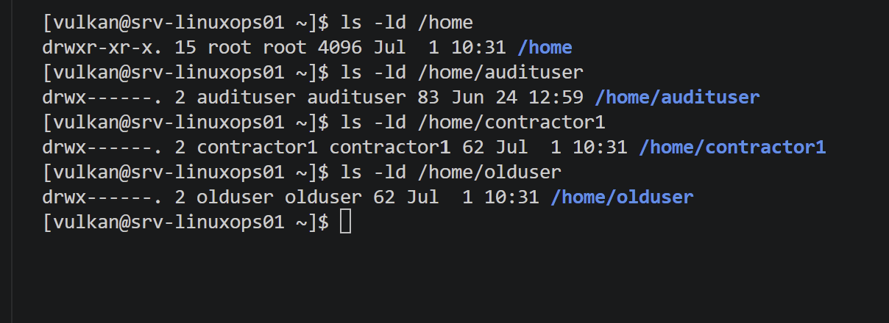

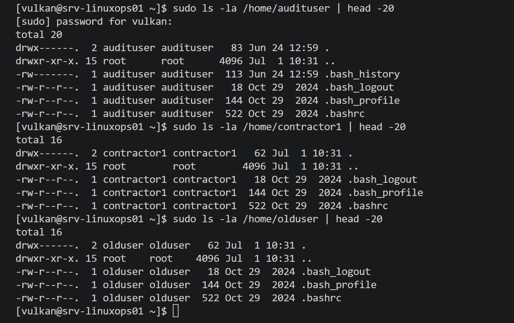

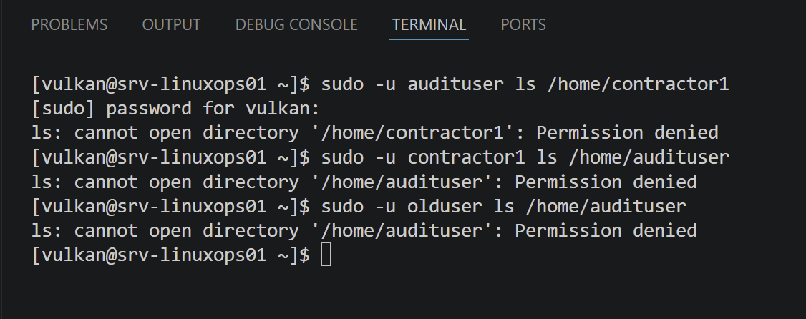

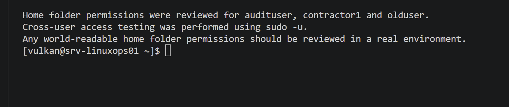

---

## 2026-07-01 — Part 7: Create and identify an access issue

### Goal

Create a controlled permission issue and identify it through Linux access review commands.

### Work completed

* Created the `/opt/audit-share` test folder.
* Set folder ownership to `root:audit_team`.
* Set folder permissions to `775`.
* Created the safe test file `audit-note.txt`.
* Set file ownership to `root:audit_team`.
* Set file permissions to `664`.
* Tested file access as `audituser`.
* Tested file access as `contractor1`.
* Tested file access as `olduser`.
* Reviewed folder permissions, file permissions and user group memberships.
* Identified that users outside the intended `audit_team` group could read the test file.
* Documented the finding, risk and recommendation.
* Saved screenshot evidence.

### Verification results

| Item | Result |
| --- | --- |
| `/opt/audit-share` folder | Created |
| Folder ownership | `root:audit_team` |
| Folder permissions | `775` |
| Test file | Created |
| File ownership | `root:audit_team` |
| File permissions | `664` |
| Cross-user access | Tested |
| Access issue | Identified |
| Finding note | Created |

### Commands used

```bash
sudo mkdir -p /opt/audit-share
sudo chown root:audit_team /opt/audit-share
sudo chmod 775 /opt/audit-share
ls -ld /opt/audit-share

echo "This is a safe lab audit test file." | sudo tee /opt/audit-share/audit-note.txt
sudo chown root:audit_team /opt/audit-share/audit-note.txt
sudo chmod 664 /opt/audit-share/audit-note.txt
ls -l /opt/audit-share

sudo -u audituser cat /opt/audit-share/audit-note.txt
sudo -u contractor1 cat /opt/audit-share/audit-note.txt
sudo -u olduser cat /opt/audit-share/audit-note.txt

ls -ld /opt/audit-share
ls -l /opt/audit-share/audit-note.txt
id audituser
id contractor1
id olduser

echo "Finding: /opt/audit-share allows users outside audit_team to read audit-note.txt."
echo "Risk: Users who are not intended audit team members may access shared audit content."
echo "Recommendation: Restrict folder and file permissions to the intended group only."
```

### Command purpose

| Command | Purpose |
| --- | --- |
| `sudo mkdir -p /opt/audit-share` | Creates the controlled test folder for the access issue scenario. |
| `sudo chown root:audit_team /opt/audit-share` | Sets the folder owner to `root` and group to `audit_team`. |
| `sudo chmod 775 /opt/audit-share` | Gives owner and group full access while allowing others to read and enter the folder. |
| `ls -ld /opt/audit-share` | Shows ownership and permissions for the folder itself. |
| `echo "This is a safe lab audit test file."` | Prints safe lab test content. |
| `sudo tee /opt/audit-share/audit-note.txt` | Writes the test content to a file using administrator rights. |
| `sudo chown root:audit_team /opt/audit-share/audit-note.txt` | Sets the file owner to `root` and group to `audit_team`. |
| `sudo chmod 664 /opt/audit-share/audit-note.txt` | Allows owner and group to read/write while allowing others to read the file. |
| `ls -l /opt/audit-share` | Lists the file and its permissions inside the test folder. |
| `sudo -u audituser cat /opt/audit-share/audit-note.txt` | Tests whether `audituser` can read the test file. |
| `sudo -u contractor1 cat /opt/audit-share/audit-note.txt` | Tests whether `contractor1` can read the test file. |
| `sudo -u olduser cat /opt/audit-share/audit-note.txt` | Tests whether `olduser` can read the test file. |
| `ls -l /opt/audit-share/audit-note.txt` | Shows the test file permissions directly. |
| `id audituser` | Shows group memberships for `audituser`. |
| `id contractor1` | Shows group memberships for `contractor1`. |
| `id olduser` | Shows group memberships for `olduser`. |
| `echo "Finding: ..."` | Documents the access finding. |
| `echo "Risk: ..."` | Documents the risk of the finding. |
| `echo "Recommendation: ..."` | Documents the recommended action. |

### Notes

This part demonstrates how a permission issue can be created and identified safely in a lab environment.

The folder permission `775` allowed users outside the intended group to enter the folder.

The file permission `664` allowed users outside the intended group to read the test file.

The issue was confirmed by testing access as multiple users and comparing that access with each user’s group membership.

In a real environment, this type of issue should be reviewed and corrected if the content is intended only for a specific group.

### Evidence

Screenshots:


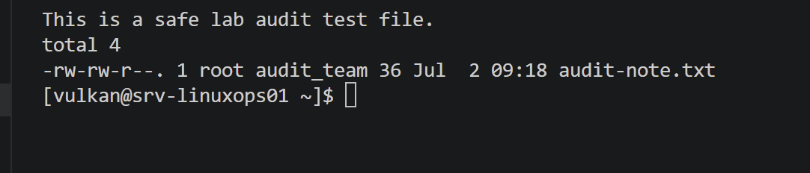

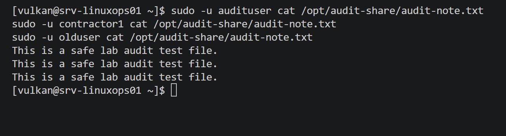

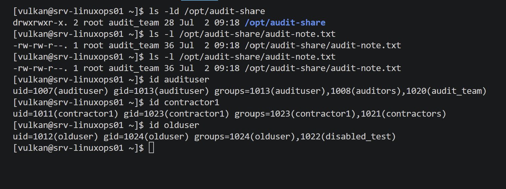

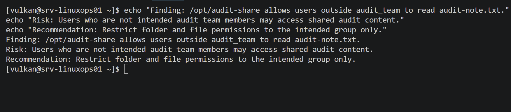

---

## 2026-07-02 — Part 8: Review login history

### Goal

Review successful login history, current sessions and last login information.

### Work completed

* Reviewed recent successful login history.
* Reviewed login history for `audituser`.
* Reviewed login history for `contractor1`.
* Reviewed login history for `olduser`.
* Reviewed currently logged-in users.
* Reviewed active login sessions and activity.
* Reviewed last login summary for local accounts.
* Created an audit note about login history review.
* Saved screenshot evidence.

### Verification results

| Item | Result |
| --- | --- |
| Recent successful logins | Reviewed |
| `audituser` login history | Reviewed |
| `contractor1` login history | Reviewed |
| `olduser` login history | Reviewed |
| Current login sessions | Reviewed |
| Last login summary | Reviewed |
| Audit note | Created |
| Sensitive data exposed | No |

### Commands used

```bash
last | head -20

last audituser | head -10
last contractor1 | head -10
last olduser | head -10

who
w

lastlog | head -20

echo "Successful login history was reviewed with last."
echo "Current active sessions were reviewed with who and w."
echo "Last login summary was reviewed with lastlog."
echo "Unused or unexpected accounts should be reviewed in a real environment."
```

### Command purpose

| Command | Purpose |
| --- | --- |
| `last \| head -20` | Shows the most recent successful login records while keeping the output short. |
| `last audituser \| head -10` | Shows successful login history for `audituser`. |
| `last contractor1 \| head -10` | Shows successful login history for `contractor1`. |
| `last olduser \| head -10` | Shows successful login history for `olduser`. |
| `who` | Shows currently logged-in users. |
| `w` | Shows currently logged-in users, active sessions, idle time and current activity. |
| `lastlog \| head -20` | Shows last login information for local accounts while keeping the output readable. |
| `echo ...` | Creates a clear audit note about login history review. |

### Notes

This part demonstrates basic Linux login history review.

Successful login history helps show which accounts accessed the system and when.

Current session review helps identify users who are logged in right now.

The last login summary helps identify accounts that have never logged in or have not logged in recently.

Private internal lab IP addresses may appear in login history when using a VM, NAT or local lab network. These addresses are not public internet addresses.

In a real environment, unexpected login times, unknown source addresses, unused accounts with recent logins, or abandoned accounts should be reviewed.

### Evidence

Screenshots:

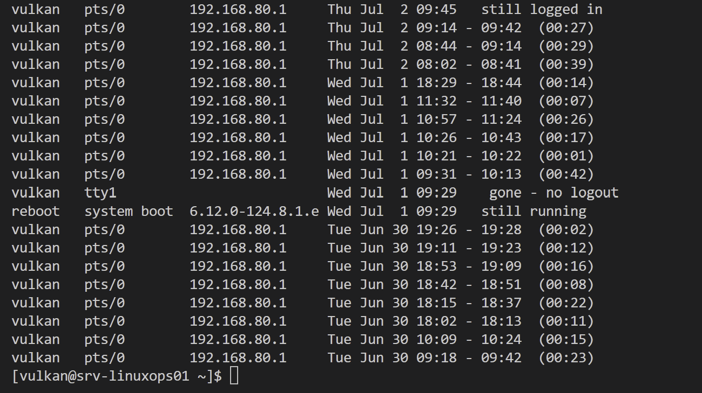

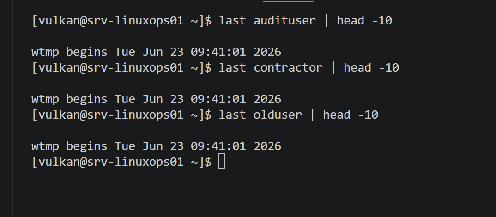

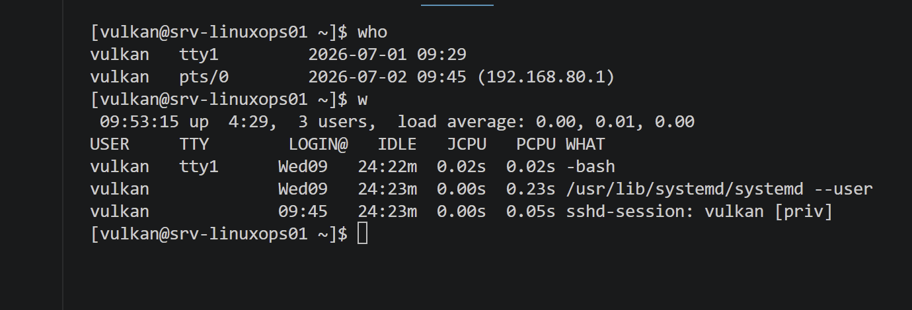

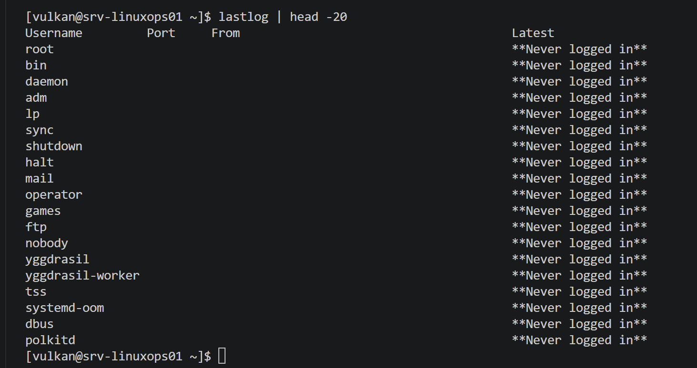

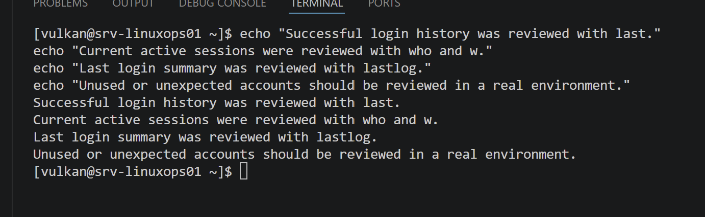

